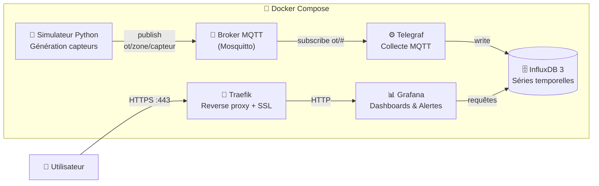

# 🏭 OT-Monitoring

Plateforme de supervision d'un environnement **OT (Operational Technology)** : simulation de capteurs industriels, diffusion des mesures via un broker MQTT, collecte avec Telegraf, stockage en base de séries temporelles InfluxDB 3 et visualisation/alerting dans Grafana, le tout orchestré avec Docker Compose et exposé en HTTPS via Traefik.

---

## Fonctionnalités

- **Simulation de capteurs OT** : génération de valeurs 
- **Diffusion temps réel** des mesures via le protocole **MQTT**
- **Collecte** des messages MQTT par **Telegraf**,
- **Stockage** des séries temporelles dans **InfluxDB 3**
- **Dashboards Grafana** pour visualiser les données
- **Règles d'alerte** configurables dans Grafana en cas de dépassement de seuils
- **Accès sécurisé** en HTTPS avec certificats SSL gérés automatiquement par **Traefik**

---

## Stack technique

| Composant | Rôle |
|---|---|
| **Python** (simulateur) | Génération des données capteurs et publication MQTT (conteneurisé) |
| **MQTT** (Mosquitto) | Broker de messages qui découple les producteurs des consommateurs |
| **Telegraf** | Abonnement aux topics MQTT, parsing des mesures et écriture dans InfluxDB |
| **InfluxDB 3** | Base de données de séries temporelles (requêtes SQL / InfluxQL) |
| **Grafana** | Visualisation des données et règles d'alerte, connecté directement à InfluxDB |
| **Traefik** | Reverse proxy et gestion des certificats SSL |
| **Docker Compose** | Orchestration de l'ensemble des conteneurs |

---

## 🗺️ Schéma d'architecture



---

## Get Started

### Prérequis
- docker et docker-compose installés sur votre machine
- git
- htpasswd

### cloner le projet

```bash
git clone https://github.com/yourusername/ot-monitoring.git
```

### Configuration

Configurer le mot de passe pour l'accès au broker MQTT (Mosquitto) :

```bash
touch mosquitto/config/passwd
# https://mosquitto.org/man/mosquitto_passwd-1.html
mosquitto_passwd [ -H hash ] [ -c | -D ] passwordfile username
chmod 0700 mosquitto/config/passwd

cp telegraf/.env.example telegraf/.env
```

Modifier les variables d'environnement dans telegraf/.env avec les valeurs créées pour le broker MQTT.


Configurer l'utilisateur de traefik :

```bash
htpasswd -nb admin MotDePasse
```

Modifier la valeur ligne 15 du fichier `traefik/dynamic/dashboard.yml` avec le hash du mot de passe généré.

### Lancer la stack

```bash
docker-compose up -d
```